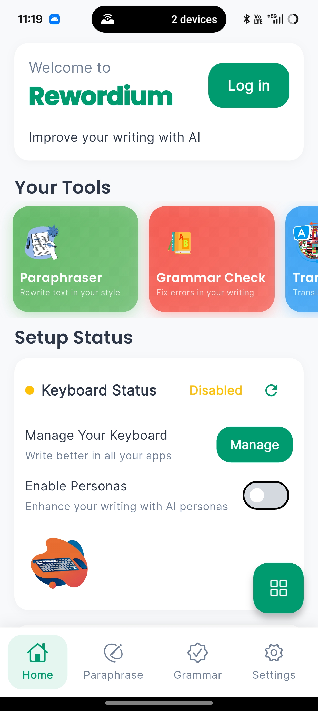
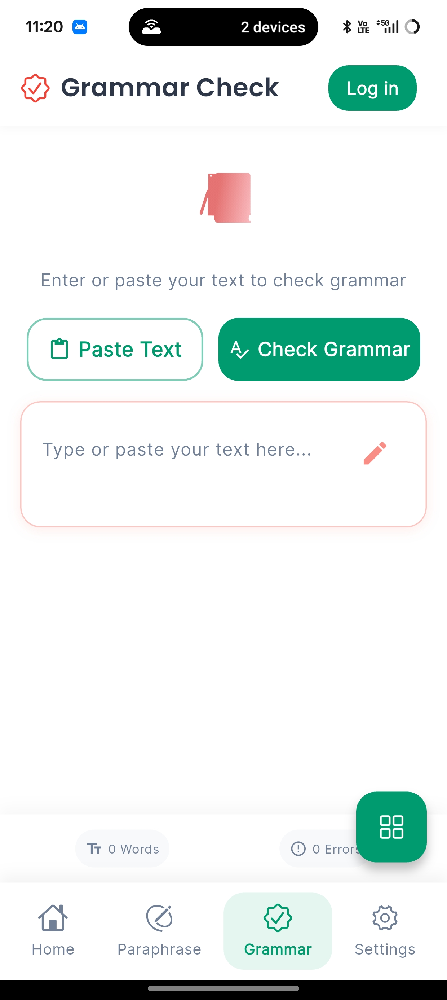
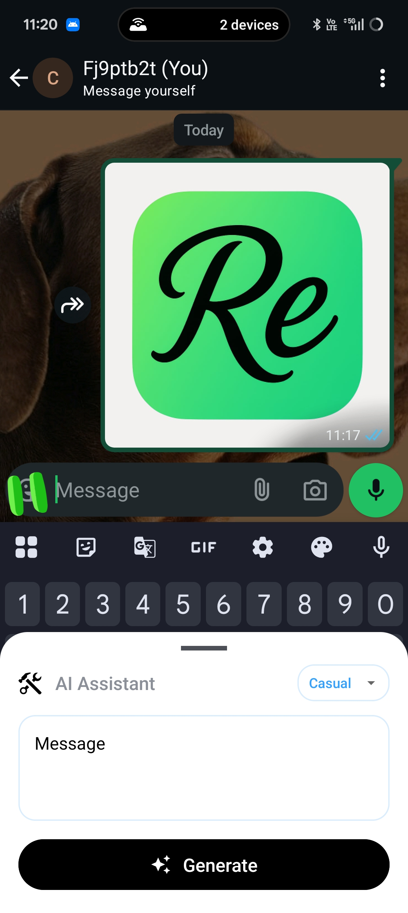
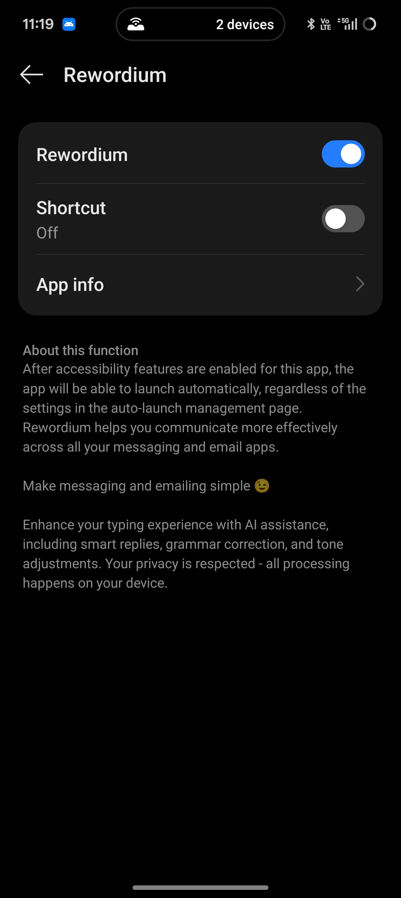
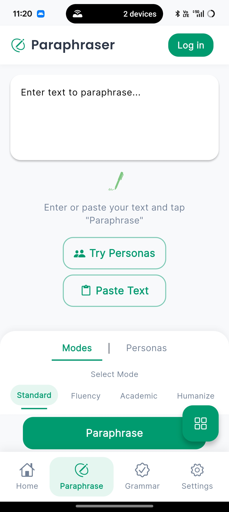
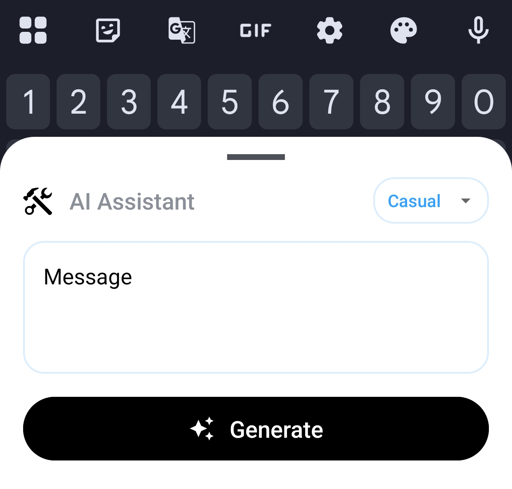

# Rewordium

Rewordium is a cross-platform AI-powered writing assistant that offers paraphrasing, summarization, and tone editing. Built using Flutter, it works on Android, iOS, and Web platforms. The app is designed to enhance writing productivity with real-time AI features.

## Features

- Paraphrasing with contextual awareness
- Summarization of large content
- Tone editing (formal, casual, neutral, etc.)
- Floating overlay assistant for seamless access
- Authentication and storage via Firebase
- Real-time AI response using LLaMA 3 (via Groq)

## Tech Stack

- Flutter (Mobile + Web)
- Firebase Authentication & Firestore
- Groq APIs (LLaMA 3)
- Custom NLP handling

## Play Store (Closed Testing)

Rewordium is currently in closed testing.

[Join via Google Play Closed Testing](https://play.google.com/apps/testing/com.noxquill.rewordium)  
Package Name: `com.noxquill.rewordium`

## Screenshots

Below are screenshots from the current testing build:

  
  
  

  
  
  

## Repository Scope

This repository is for demonstration purposes only. The production source code is private and not publicly available.

## Contact

For testing access or collaboration inquiries:

**Email:** chethankrishna2022@gmail.com  
**LinkedIn:** [https://linkedin.com/in/chethan-krishna-manikonda-33561628a](https://linkedin.com/in/chethan-krishna-manikonda-33561628a)
